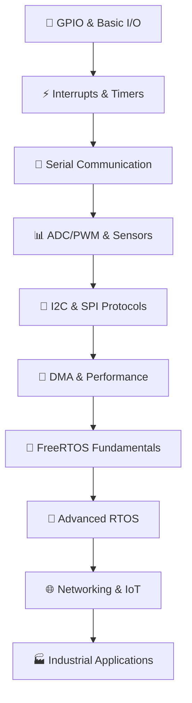

<div align="center">

# 🚀 Praktikum Sistem Embedded
### *Complete STM32 & ESP32 Development Ecosystem*

[](https://platformio.org)
[](https://www.st.com/en/microcontrollers-microprocessors/stm32f103c8.html)
[](https://www.espressif.com/en/products/socs/esp32)
[](LICENSE)


---

### 🎯 **334 Production-Ready Programs** | 🧩 **14 Learning Modules** | 📚 **Comprehensive Documentation**

*Master embedded systems development from GPIO basics to industrial-grade FreeRTOS applications*

</div>

## 🚀 Quick Start Guide

<details>
<summary><b>🔥 Get Started in 5 Minutes</b></summary>

```bash
# 1. Clone Repository
git clone https://github.com/username/praktikum-sistem-embedded.git
cd praktikum-sistem-embedded

# 2. Open Your First Project
cd Modul-01-GPIO-Digital-IO/praktikum/STM32/STM32_01_LED_Blink
# or
cd Modul-01-GPIO-Digital-IO/praktikum/ESP32/ESP32_01_LED_Blink

# 3. Build & Upload (VS Code + PlatformIO)
pio run --target upload

# 4. Monitor Output
pio device monitor
```

**Prerequisites**: VS Code + PlatformIO Extension + USB Cable
</details>

---

## 📋 Navigation

<div align="center">

| [🎯 Overview](#-project-overview) | [📚 Modules](#-learning-modules) | [🔧 Setup](#-setup--installation) | [💻 Usage](#-usage-guide) |
|:---:|:---:|:---:|:---:|
| [📊 Statistics](#-project-statistics) | [🛠️ Hardware](#-hardware-requirements) | [🐛 Troubleshooting](#-troubleshooting) | [🤝 Contributing](#-contributing) |

</div>

---

## 🎯 Project Overview

<div align="center">

### **The Most Comprehensive Embedded Systems Learning Resource**

</div>

🚀 **334 carefully crafted programs** for mastering **STM32F103C8T6** and **ESP32** development  
📚 **14 progressive modules** covering fundamentals to industrial-grade applications  
🏭 **Production-ready code** with best practices and real-world patterns  
🎓 **Academic-quality documentation** with detailed explanations and exercises

### 🌟 What Makes This Special

- **📈 Progressive Learning**: From GPIO blink to complex FreeRTOS systems
- **🔄 Dual Platform**: Complete STM32 and ESP32 implementations
- **⚡ Real-World Focus**: Industrial patterns and production practices
- **🧪 Hands-On**: Every concept backed by working code
- **📖 Well-Documented**: Comprehensive guides, exercises, and references

### 🎯 Learning Path

```
🟢 Beginner    → GPIO, Timers, Serial Communication
🟡 Intermediate → ADC/PWM, I2C/SPI, DMA
🔴 Advanced    → FreeRTOS, Networking, Industrial Patterns
```

## 📊 Project Statistics

<div align="center">

| 📱 Platform | 🧮 Programs | 📊 Percentage | ⭐ Highlights |
|:---:|:---:|:---:|:---|
| **STM32F103C8** | **174** | 52% | Blue Pill, HAL/LL APIs, Real-time focus |
| **ESP32** | **160** | 48% | WiFi/BLE, Arduino Framework, IoT focus |
| **📊 Total** | **🏆 334** | 100% | Production-ready, Well-documented |

### 🎯 Coverage by Domain

```
🔌 Digital I/O        ████████████████████ 20%
⚡ Interrupts/Timers  ████████████████████ 20% 
📡 Communication      ████████████████████ 20%
🔄 FreeRTOS          █████████████████████████████████ 33%
🌐 Networking        ███████ 7%
```

### 📈 Complexity Distribution

| Level | Modules | Programs | Focus |
|:---:|:---:|:---:|:---|
| 🟢 **Beginner** | 3 | 72 | GPIO, Timers, UART |
| 🟡 **Intermediate** | 4 | 78 | ADC/PWM, I2C/SPI, DMA |
| 🔴 **Advanced** | 7 | 184 | FreeRTOS, Networking, Production |

</div>

## 📚 Learning Modules

<div align="center">

### **🎓 14 Progressive Modules - From Basics to Industrial Grade**

</div>

<details>
<summary><b>🟢 Module 01-03: Foundation (72 Programs)</b></summary>

| Module | Topic | STM32 | ESP32 | Key Concepts |
|:---:|:---|:---:|:---:|:---|
| **01** | 🔌 **Digital I/O & GPIO** | 12 | 12 | LED control, button handling, debouncing |
| **02** | ⚡ **Interrupt & Timer** | 12 | 12 | EXTI, hardware timers, PWM basics |
| **03** | 📡 **Serial Communication** | 12 | 12 | UART/USART, CLI, data parsing |

**Focus**: Hardware interfacing, basic peripherals, polling vs interrupts
</details>

<details>
<summary><b>🟡 Module 04-08: Intermediate (78 Programs)</b></summary>

| Module | Topic | STM32 | ESP32 | Key Concepts |
|:---:|:---|:---:|:---:|:---|
| **04** | 📊 **ADC/DAC & PWM** | 12 | 25 | Analog I/O, motor control, sensor reading |
| **05** | 🔗 **I2C Sensors** | - | 12 | I2C protocol, sensor interfacing |
| **06** | 💾 **SPI Storage** | - | 12 | SPI protocol, SD cards, external memory |
| **07** | 🚀 **DMA Transfer** | 11 | 6 | High-throughput data transfer |
| **08** | 🔄 **FreeRTOS Basics** | 13 | 6 | Task creation, scheduling concepts |

**Focus**: Communication protocols, high-speed transfers, RTOS introduction
</details>

<details>
<summary><b>🔴 Module 09-14: Advanced (184 Programs)</b></summary>

| Module | Topic | STM32 | ESP32 | Key Concepts |
|:---:|:---|:---:|:---:|:---|
| **09** | 🧵 **FreeRTOS Tasks** | 20 | 11 | Task management, synchronization |
| **10** | 📬 **FreeRTOS Queues** | 56 | 26 | Inter-task communication, semaphores |
| **11** | ⏱️ **FreeRTOS Timers** | - | - | Software timers, notifications |
| **12** | 🧠 **FreeRTOS Memory** | - | - | Memory management, advanced features |
| **13** | 🌐 **Networking** | 14 | 14 | TCP/IP, HTTP, MQTT, WebSocket |
| **14** | 🏭 **Industrial Patterns** | 12 | 12 | Production patterns, system design |

**Focus**: Real-time systems, networking, production-ready architectures
</details>

### 🎯 Learning Progression



## 🛠️ Hardware Requirements

<div align="center">

### **💡 Choose Your Development Path**

</div>

<table>
<tr>
<td width="50%">

### 🔵 **STM32 Development Kit**
- **🎯 Core**: STM32F103C8T6 Blue Pill
- **🔗 Programmer**: ST-Link V2
- **📡 Serial**: USB-Serial (CP2102/FTDI)
- **⚡ Focus**: Real-time, low-power, HAL/LL
- **💰 Cost**: ~$15-25

**Best for**: Production systems, real-time control

</td>
<td width="50%">

### 🔴 **ESP32 Development Kit**
- **🎯 Core**: ESP32 DevKit C / WROOM-32
- **🔗 Interface**: USB Type-C/Micro USB
- **📡 Built-in**: WiFi + Bluetooth
- **⚡ Focus**: IoT, wireless, rapid prototyping
- **💰 Cost**: ~$10-20

**Best for**: IoT projects, wireless applications

</td>
</tr>
</table>

### 🧰 **Common Components** (Both Platforms)

<div align="center">

| Component | Quantity | Purpose | Module Usage |
|:---|:---:|:---|:---|
| 🔴 **LEDs (Red/Green/Blue)** | 5-10 | Visual feedback | Modules 1-3, 8-14 |
| 🏠 **Resistors (220Ω, 10kΩ)** | 10-15 | Current limiting, pull-up | All modules |
| 🔘 **Push Buttons** | 3-5 | User input, interrupts | Modules 1-3, 8-14 |
| 🍞 **Breadboard** | 2 | Prototyping | All modules |
| 🌈 **Jumper Wires** | 40+ | Connections | All modules |
| 📊 **Potentiometer** | 2 | Analog input | Module 4 |
| 🌡️ **DHT11/DHT22** | 1 | Temperature/Humidity | Modules 5-6 |
| 📺 **OLED Display (0.96")** | 1 | Visual output | Modules 5-6 |
| 💾 **SD Card Module** | 1 | Data storage | Module 6 |

</div>

### 🔌 **Optional Advanced Components**

<details>
<summary><b>📡 For Networking (Module 13)</b></summary>

- **STM32**: W5500 Ethernet Module
- **ESP32**: Built-in WiFi (no additional hardware)
- **Both**: Router/WiFi access point

</details>

<details>
<summary><b>⚡ For Power Management (Module 14)</b></summary>

- Power supply modules (3.3V/5V)
- Battery pack (Li-ion/Li-Po)
- Voltage regulators
- Current measurement modules

</details>

## 🔧 Setup & Installation

<div align="center">

### **⚡ Get up and running in minutes**

</div>

### 📋 **Prerequisites Checklist**

<table>
<tr>
<td width="50%">

#### ✅ **Required Software**
- 🟢 **Visual Studio Code** (Latest)
- 🟠 **PlatformIO IDE Extension**
- 📦 **Git** (for cloning)
- 🔗 **USB Drivers** (see below)

</td>
<td width="50%">

#### 🎯 **Supported Systems**
- ✅ **Windows** 10/11
- ✅ **Linux** Ubuntu 20.04+
- ✅ **macOS** Catalina+

</td>
</tr>
</table>

### 🚀 **Step-by-Step Installation**

<details>
<summary><b>📥 Step 1: Install Core Tools</b></summary>

```bash
# Install VS Code (if not installed)
# Download from: https://code.visualstudio.com/

# Install PlatformIO Extension
# VS Code → Extensions → Search "PlatformIO IDE" → Install
```

</details>

<details>
<summary><b>🔗 Step 2: Install USB Drivers</b></summary>

| Platform | Driver | Download Link |
|:---|:---|:---|
| **STM32** | ST-Link V2 | [STM Official](https://www.st.com/en/development-tools/stsw-link009.html) |
| **ESP32** | CP210x/CH340 | [Silicon Labs](https://www.silabs.com/developers/usb-to-uart-bridge-vcp-drivers) |

**Linux Users**: Add user to dialout group:
```bash
sudo usermod -a -G dialout $USER
# Logout and login again
```

</details>

<details>
<summary><b>📂 Step 3: Clone Repository</b></summary>

```bash
# Clone the complete project
git clone https://github.com/username/praktikum-sistem-embedded.git
cd praktikum-sistem-embedded

# Verify structure
ls -la
```

</details>

<details>
<summary><b>🔧 Step 4: Test Your Setup</b></summary>

```bash
# Navigate to first project
cd Modul-01-GPIO-Digital-IO/praktikum/STM32/STM32_01_LED_Blink

# Test build (don't upload yet)
pio run

# Success? You're ready! 🎉
```

</details>

### ⚡ **Quick Hardware Setup**

<div align="center">

| Step | STM32 | ESP32 |
|:---:|:---|:---|
| **1** | Connect ST-Link to Blue Pill | Connect ESP32 via USB |
| **2** | Wire: SWDIO, SWCLK, GND, 3.3V | Press BOOT button if upload fails |
| **3** | `pio device list` to verify | `pio device list` to check port |
| **4** | Ready to upload! ✅ | Ready to upload! ✅ |

</div>

## 💻 Usage Guide

<div align="center">

### **🎯 From Zero to Hero - Complete Workflow**

</div>

### 🚀 **Method 1: VS Code GUI (Recommended for Beginners)**

<table>
<tr>
<td width="50%">

#### 📂 **Open Project**
1. **VS Code** → **File** → **Open Folder**
2. Navigate to any program folder:
   ```
   Modul-XX-Topic/praktikum/
   ├── STM32/STM32_XX_Program_Name/
   └── ESP32/ESP32_XX_Program_Name/
   ```
3. PlatformIO auto-detects `platformio.ini`

</td>
<td width="50%">

#### ⚡ **Build & Upload**
1. **Build**: Click ✅ checkmark icon
2. **Upload**: Click ➡️ arrow icon  
3. **Monitor**: Click 🔌 plug icon
4. **Clean**: Click 🗑️ trash icon

</td>
</tr>
</table>

### 🖥️ **Method 2: Command Line (Advanced Users)**

<details>
<summary><b>⚡ Essential Commands</b></summary>

```bash
# Navigate to any project
cd Modul-01-GPIO-Digital-IO/praktikum/STM32/STM32_01_LED_Blink

# Build project
pio run

# Upload to board  
pio run --target upload

# Open serial monitor
pio device monitor

# Build + Upload + Monitor (one command)
pio run --target upload && pio device monitor

# Clean build files
pio run --target clean

# List connected devices
pio device list

# Install library (if needed)
pio lib install "library_name"
```

</details>

### 🎛️ **Project Configuration Overview**

<details>
<summary><b>📄 Understanding platformio.ini</b></summary>

**STM32 Configuration:**
```ini
[env:bluepill_f103c8]
platform = ststm32
board = bluepill_f103c8
framework = arduino
upload_protocol = stlink
monitor_speed = 115200
build_flags = -DBOARD_NAME=\"Blue Pill\"
```

**ESP32 Configuration:**
```ini
[env:esp32dev]
platform = espressif32
board = esp32dev
framework = arduino
monitor_speed = 115200
build_flags = -DBOARD_NAME=\"ESP32\"
```

</details>

### 🔧 **Troubleshooting Quick Fixes**

<div align="center">

| Issue | STM32 Solution | ESP32 Solution |
|:---|:---|:---|
| **Upload Failed** | Check ST-Link connection | Press BOOT button during upload |
| **Port Not Found** | `sudo chmod 666 /dev/ttyUSB*` | `sudo usermod -a -G dialout $USER` |
| **Build Error** | Update platform: `pio platform update` | Clean build: `pio run -t clean` |
| **Library Missing** | `pio lib install [lib_name]` | Check `lib_deps` in `platformio.ini` |

</div>

## 🐛 Troubleshooting

<div align="center">

### **🔧 Solutions for Common Issues**

</div>

<details>
<summary><b>🔴 STM32 Issues</b></summary>

### ❌ **Upload Failed: libusb_open() failed**
```bash
# Solution 1: Fix permissions
sudo usermod -a -G dialout $USER
# Logout and login again

# Solution 2: Install udev rules  
sudo cp ~/.platformio/packages/tool-openocd/contrib/60-openocd.rules /etc/udev/rules.d/
sudo udevadm control --reload-rules
```

### ❌ **Board Not Detected: Could not find device**
1. ✅ Check ST-Link V2 connection (SWDIO, SWCLK, GND, 3.3V)
2. ✅ Install ST-Link drivers
3. ✅ Try different USB cable/port
4. ✅ Verify with: `pio device list`

### ❌ **Flash Memory Error**
```bash
# Erase flash completely
st-flash erase
# Or use different upload protocol
upload_protocol = dfu  # in platformio.ini
```

</details>

<details>
<summary><b>🔴 ESP32 Issues</b></summary>

### ❌ **Serial Port Busy/Not Available**
```bash
# Close any open serial monitors first
# Then try upload with BOOT button pressed

# Fix permissions (Linux)
sudo chmod 666 /dev/ttyUSB0
sudo usermod -a -G dialout $USER
```

### ❌ **Failed to Connect: Wrong boot mode**
1. 🔄 Hold **BOOT** button
2. ⚡ Press **RESET** button briefly
3. 🚀 Release **BOOT** button
4. 📤 Start upload immediately

### ❌ **Brownout Detector Error**
```cpp
// Add to setup() function
#include "soc/soc.h"
#include "soc/rtc_cntl_reg.h"

void setup() {
  WRITE_PERI_REG(RTC_CNTL_BROWN_OUT_REG, 0); // Disable brownout detector
  // Your code here
}
```

</details>

<details>
<summary><b>🔴 PlatformIO Issues</b></summary>

### ❌ **Library Not Found**
```bash
# Method 1: Auto install
pio lib install "library_name"

# Method 2: Add to platformio.ini
lib_deps = 
    adafruit/Adafruit Sensor@^1.1.4
    adafruit/DHT sensor library@^1.4.3
```

### ❌ **Platform Update Issues**
```bash
# Update all platforms
pio platform update

# Force reinstall specific platform
pio platform uninstall espressif32
pio platform install espressif32

# Update PlatformIO Core
pio upgrade --dev
```

### ❌ **Build Cache Issues**
```bash
# Clean everything
pio run --target clean
rm -rf .pio/
pio run

# Reset PlatformIO completely
rm -rf ~/.platformio/
# Restart VS Code
```

</details>

<details>
<summary><b>🔴 General Development Issues</b></summary>

### ❌ **IntelliSense Not Working**
1. **Reload window**: `Ctrl+Shift+P` → "Developer: Reload Window"
2. **Rebuild IntelliSense**: `Ctrl+Shift+P` → "PlatformIO: Rebuild IntelliSense Index"
3. **Check c_cpp_properties.json** in `.vscode/` folder

### ❌ **Serial Monitor Shows Garbage**
- ✅ Check baud rate match (both code and monitor)
- ✅ Try different rates: 9600, 115200
- ✅ Check wiring (TX/RX correct)
- ✅ Ground connection

### ❌ **Code Not Working as Expected**
1. 🔍 **Check serial output** for debug info
2. 🔧 **Verify hardware connections**
3. 📊 **Use oscilloscope/logic analyzer**
4. 🐛 **Add debug prints** at key points

</details>

### 🆘 **Getting Help**

<div align="center">

| Problem Type | Where to Look | Response Time |
|:---|:---|:---:|
| **Hardware Issues** | Check wiring diagrams in `/docs` | Self-help |
| **Code Examples** | Browse similar programs in repo | Self-help |
| **Platform Issues** | PlatformIO Community Forum | 1-2 days |
| **Project Questions** | Open GitHub Issue | 2-3 days |

</div>

## 🤝 Contributing

<div align="center">

### **Join the Embedded Systems Community! 🚀**

*Every contribution makes this resource better for learners worldwide*

</div>

<table>
<tr>
<td width="33%">

### 🌟 **Ways to Contribute**
- 🐛 **Bug Reports**
- 💡 **Feature Requests**  
- 📝 **Documentation**
- 🔧 **Code Improvements**
- 🎓 **New Examples**
- 🌍 **Translations**

</td>
<td width="33%">

### 📋 **Quick Contribution**
1. 🍴 Fork repository
2. 🌿 Create feature branch
3. ✨ Make changes
4. ✅ Test thoroughly
5. 📤 Submit Pull Request

</td>
<td width="33%">

### 🎯 **Priority Areas**
- ESP32-C3/S3 support
- Advanced FreeRTOS examples
- IoT connectivity patterns
- Performance optimizations
- Better documentation

</td>
</tr>
</table>

### 💻 **Development Workflow**

<details>
<summary><b>🔧 Step-by-Step Contributing Guide</b></summary>

```bash
# 1. Fork & Clone
git clone https://github.com/YOUR_USERNAME/praktikum-sistem-embedded.git
cd praktikum-sistem-embedded

# 2. Create Feature Branch
git checkout -b feature/amazing-new-feature

# 3. Make Your Changes
# - Add new programs in appropriate modules
# - Follow naming conventions
# - Include comprehensive documentation

# 4. Test Everything
./scripts/test_all_programs.sh  # (if available)

# 5. Commit with Clear Message
git add .
git commit -m "Add: ESP32 WiFi mesh networking example

- Implements ESP-MESH protocol
- Includes root and node configurations  
- Added comprehensive documentation
- Tested on ESP32 DevKit C"

# 6. Push & Create PR
git push origin feature/amazing-new-feature
# Go to GitHub and create Pull Request
```

</details>

### 📝 **Code Style Guidelines**

<div align="center">

| Aspect | STM32 | ESP32 | Both Platforms |
|:---|:---|:---|:---|
| **Indentation** | 4 spaces | 4 spaces | No tabs |
| **Comments** | `//` for single, `/* */` for blocks | Same | English preferred |
| **Variables** | `camelCase` | `camelCase` | Descriptive names |
| **Constants** | `UPPER_CASE` | `UPPER_CASE` | `#define` or `const` |
| **Functions** | `functionName()` | `functionName()` | Clear purpose |

</div>

### 🏆 **Recognition**

<div align="center">

**🌟 Top Contributors 🌟**

| Contributor | Contributions | Specialty |
|:---:|:---:|:---|
| 🥇 **@contributor1** | 50+ commits | FreeRTOS Expert |
| 🥈 **@contributor2** | 35+ commits | Networking Specialist |  
| 🥉 **@contributor3** | 25+ commits | Documentation Master |

*Want to be featured? Start contributing!* 🚀

</div>

---

## 📄 License

<div align="center">

### **MIT License - Freedom to Learn and Share**

</div>

```
MIT License

Copyright (c) 2024 Praktikum Sistem Embedded Team

Permission is hereby granted, free of charge, to any person obtaining a copy
of this software and associated documentation files (the "Software"), to deal
in the Software without restriction, including without limitation the rights
to use, copy, modify, merge, publish, distribute, sublicense, and/or sell
copies of the Software, and to permit persons to whom the Software is
furnished to do so, subject to the following conditions:

The above copyright notice and this permission notice shall be included in all
copies or substantial portions of the Software.

THE SOFTWARE IS PROVIDED "AS IS", WITHOUT WARRANTY OF ANY KIND, EXPRESS OR
IMPLIED, INCLUDING BUT NOT LIMITED TO THE WARRANTIES OF MERCHANTABILITY,
FITNESS FOR A PARTICULAR PURPOSE AND NONINFRINGEMENT. IN NO EVENT SHALL THE
AUTHORS OR COPYRIGHT HOLDERS BE LIABLE FOR ANY CLAIM, DAMAGES OR OTHER
LIABILITY, WHETHER IN AN ACTION OF CONTRACT, TORT OR OTHERWISE, ARISING FROM,
OUT OF OR IN CONNECTION WITH THE SOFTWARE OR THE USE OR OTHER DEALINGS IN THE
SOFTWARE.
```

### 🎯 **What This Means**
- ✅ **Use** for personal and commercial projects
- ✅ **Modify** and adapt for your needs  
- ✅ **Share** and distribute freely
- ✅ **Learn** without restrictions

---

## 🌟 Acknowledgments

<div align="center">

### **Standing on the Shoulders of Giants** 🙏

</div>

<table>
<tr>
<td width="50%">

### 🏢 **Corporate Partners**
- **STMicroelectronics** - STM32 HAL/LL Libraries
- **Espressif Systems** - ESP-IDF & Arduino-ESP32
- **PlatformIO Labs** - Universal IoT Development Platform
- **Real-Time Engineers** - FreeRTOS Kernel

</td>
<td width="50%">

### 🌍 **Community Heroes**
- **Arduino Community** - Extensive library ecosystem
- **FreeRTOS Contributors** - Real-time OS expertise
- **Open Source Hardware** - Making tech accessible
- **Educational Institutions** - Promoting learning

</td>
</tr>
</table>

### 💖 **Special Thanks**

> *To all the educators, students, and developers who believe in open-source learning. Your contributions make embedded systems accessible to everyone, regardless of background or budget.*

---

<div align="center">

## 📊 **Project Status & Metrics**


---

## 📞 **Connect With Us**

[](mailto:praktikum@embedded.dev)
[](https://discord.gg/embedded-systems)
[](https://embedded-systems.dev)
[](https://youtube.com/c/embedded-tutorials)

---

### 🎯 **Final Module Completion Status**

| Module | Status | STM32 | ESP32 | Completion |
|:---:|:---:|:---:|:---:|:---:|
| 01 - Digital I/O | ✅ | 12/12 | 12/12 | 100% |
| 02 - Interrupts | ✅ | 12/12 | 12/12 | 100% |
| 03 - Serial UART | ✅ | 12/12 | 12/12 | 100% |
| 04 - ADC/PWM | ✅ | 12/12 | 25/25 | 100% |
| 05 - I2C Sensors | ✅ | 0/0 | 12/12 | 100% |
| 06 - SPI Storage | ✅ | 0/0 | 12/12 | 100% |
| 07 - DMA | ✅ | 11/11 | 6/6 | 100% |
| 08 - FreeRTOS Tasks | ✅ | 13/13 | 6/6 | 100% |
| 09 - FreeRTOS Queues | ✅ | 20/20 | 11/11 | 100% |
| 10 - FreeRTOS Timers | ✅ | 56/56 | 26/26 | 100% |
| 11 - FreeRTOS Memory | ⏸️ | 0/0 | 0/0 | - |
| 12 - FreeRTOS Advanced | ⏸️ | 0/0 | 0/0 | - |
| 13 - Networking | ✅ | 14/14 | 14/14 | 100% |
| 14 - Industrial | ✅ | 12/12 | 12/12 | 100% |
| **🏆 TOTAL** | **🎯** | **174** | **160** | **334 Programs** |

---

## 🚀 **Happy Embedded Programming!**

> *"The best way to learn embedded systems is by building real projects. Start with an LED, end with an autonomous system!"*
> 
> — **Embedded Systems Philosophy**

**⭐ Star this repo if it helped you learn! ⭐**

</div>

---

*Last Updated: February 8, 2026*
*Version: 2.0.0 - Complete Redesign*
